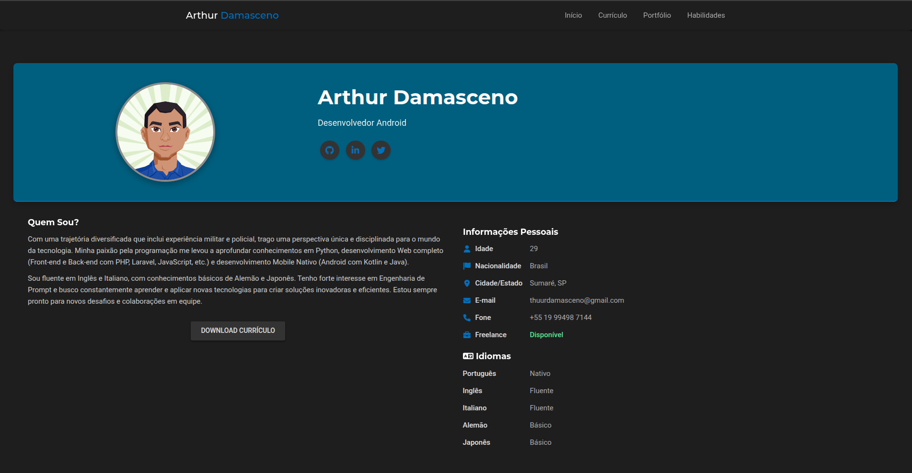
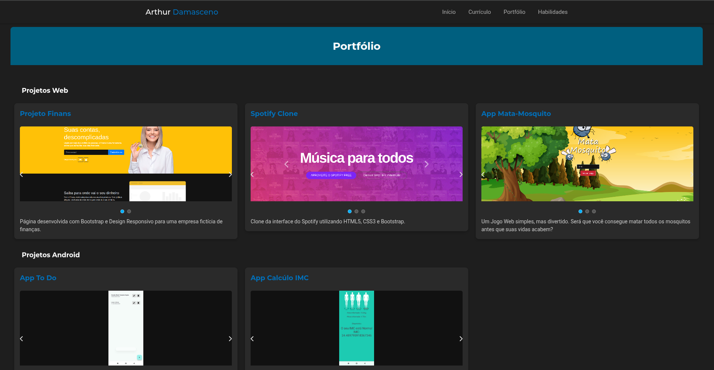

# 👨‍💻 Arthur Damasceno — Currículo Online

Este é meu **Currículo Interativo** hospedado no GitHub Pages, com foco em apresentar minhas habilidades, projetos e trajetória de forma clara, responsiva e moderna. Desenvolvido com HTML5, CSS3, JavaScript e bibliotecas como Owl Carousel.

> 💡 Acesse em: [arttt95.github.io](https://arttt95.github.io)

---

## 🧩 Tecnologias Utilizadas

- **HTML5** & **CSS3** (Responsivo)
- **JavaScript (ES6+)**
- **jQuery**
- **Bootstrap**
- **Owl Carousel**
- **Font Awesome**
- **Google Fonts**
- **GitHub Pages** (deploy)

---

## 📌 Funcionalidades

✔️ Menu fixo com scroll suave para seções  
✔️ Animação responsiva nos títulos das seções  
✔️ Carousel de imagens nos projetos estilo Instagram  
✔️ Seções bem definidas:
- Quem sou
- Currículo
- Portfólio (Web & Android)
- Habilidades

✔️ Download direto do currículo em PDF  
✔️ Links para redes sociais (GitHub, LinkedIn, Twitter)

---

## 🖼️ Capturas

| Página Inicial | Projetos | Habilidades |
|---|---|---|
|  |  |  |

---

## 🚀 Como Executar Localmente

```bash
git clone https://github.com/arttt95/arttt95.github.io.git
cd arttt95.github.io
# abra index.html no navegador
